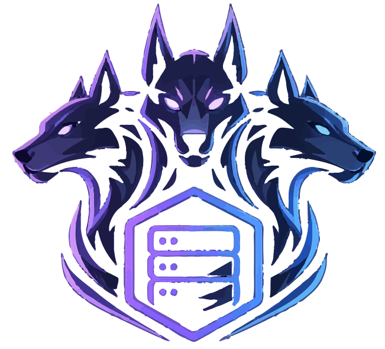
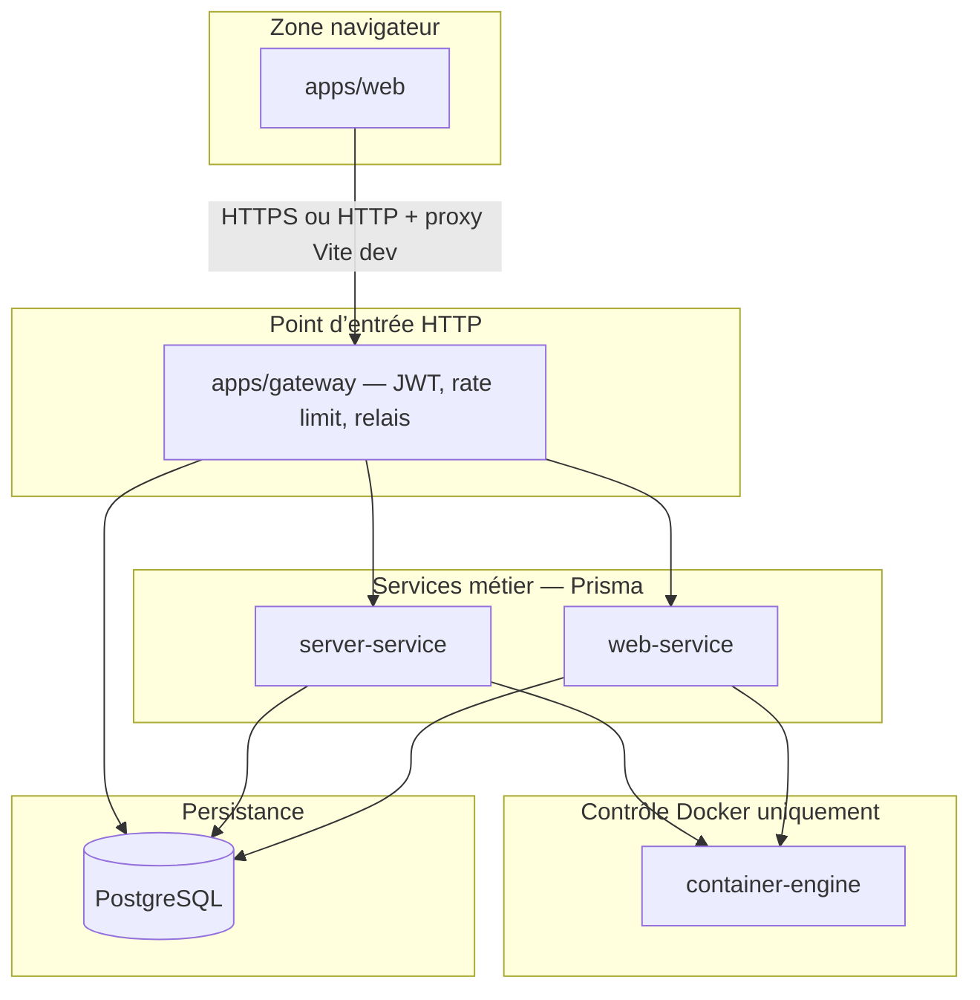

<p align="center">
  
</p>

<h1 align="center">KidoPanel</h1>

**KidoPanel** est une plateforme **PaaS** pour l’hébergement de **serveurs de jeux** (Minecraft, Valheim, Bedrock, etc.) et d’**instances web** (reverse proxy, applications conteneurisées), avec **réseaux internes Docker**, **quotas** par compte, **pare-feu hôte** (firewalld / UFW) et un **panel web** unique.

**Contrainte d’architecture** : le navigateur **ne contacte jamais** l’API Docker. Tout trafic applicatif passe par **`apps/gateway`**. **Seul** le service **`container-engine`** exécute des opérations Docker sur l’hôte (via `dockerode` / socket). Cette règle est un **périmètre de confiance** : toute exception dans le code est une anomalie de conception.

**Monorepo** : **TypeScript** strict, **`pnpm`** workspaces, orchestration **`turbo`**. Les types et contrats partagés front / back résident dans **`packages/`** et ne doivent pas être dupliqués dans les applications.

---

## Sommaire

- [Fiche d’identification du dépôt](#fiche-didentification-du-dépôt)
- [Périmètre de sécurité et confiance](#périmètre-de-sécurité-et-confiance)
- [Fonctionnalités produit](#fonctionnalités-produit)
- [Architecture logique et réseau](#architecture-logique-et-réseau)
- [Topologies de déploiement](#topologies-de-déploiement)
- [Structure du dépôt](#structure-du-dépôt)
- [Prérequis d’exécution](#prérequis-dexécution)
- [Mise en service (développement)](#mise-en-service-développement)
- [Points de contrôle (santé)](#points-de-contrôle-santé)
- [Ports, écoute et variables par service](#ports-écoute-et-variables-par-service)
- [Variables d’environnement (panorama)](#variables-denvironnement-panorama)
- [Interface web (Vite) et proxy de développement](#interface-web-vite-et-proxy-de-développement)
- [Pare-feu, NAT et adresse « connexion jeu »](#pare-feu-nat-et-adresse-connexion-jeu)
- [Base de données (Prisma / PostgreSQL)](#base-de-données-prisma--postgresql)
- [Qualité, build et tests](#qualité-build-et-tests)
- [Déploiement sur machine serveur](#déploiement-sur-machine-serveur)
- [Diagnostic d’incident (symptômes fréquents)](#diagnostic-dincident-symptômes-fréquents)
- [Documentation et gouvernance du code](#documentation-et-gouvernance-du-code)
- [Licence](#licence)

---

## Fiche d’identification du dépôt

| Élément | Valeur / référence |
|--------|---------------------|
| Gestionnaire de paquets | **pnpm** (verrou : voir champ `packageManager` dans `package.json` racine, actuellement **10.33.0**) |
| Orchestration des tâches | **Turbo** (`turbo.json`) : `build` dépend de `^build`, `test` dépend de `^build` |
| Langage | **TypeScript** (mode strict attendu dans les paquets) |
| Panel | **React** + **Vite** (`apps/web`) |
| API bordure | **Hono** sur **Node** (`apps/gateway`) |
| Persistance | **PostgreSQL** + **Prisma** (`packages/database`) |
| Conteneurs | **Docker Engine** ; accès API uniquement dans **`services/container-engine`** |

---

## Périmètre de sécurité et confiance

| Zone | Composants | Exposition | Données sensibles |
|------|------------|------------|-------------------|
| **Client** | `apps/web` | Réseau utilisateur (navigateur) | Jeton JWT en mémoire (local), jamais le socket Docker |
| **Bordure HTTP** | `apps/gateway` | Port configuré (`GATEWAY_PORT` / défaut **3000**) | `GATEWAY_JWT_SECRET`, `DATABASE_URL`, relais signés |
| **Métier** | `server-service`, `web-service` | En principe **réseau interne** / loopback | Logique quotas, Prisma, **pas** d’accès Docker direct |
| **Moteur** | `container-engine` | Par défaut **127.0.0.1:8787** — élargir (`CONTAINER_ENGINE_LISTEN_HOST`) uniquement si le réseau est contrôlé | Socket Docker, état pare-feu fichier JSON optionnel |
| **Données** | PostgreSQL | Port **5432** (Compose) ou instance gérée | Mots de passe utilisateurs (bcrypt côté passerelle), schéma métier |

**Principes** :

- Les services métier appellent le moteur en HTTP avec l’URL **`CONTAINER_ENGINE_BASE_URL`** ; ils ne doivent pas **shell-out** vers `docker`.
- La passerelle authentifie les utilisateurs et, pour les relais vers les services métier, propage une **identité interne** dérivée du JWT (en-têtes internes — détail implémentation dans le code `apps/gateway` et middlewares `@kidopanel/database`).
- Le moteur ne doit **pas** être exposé sur Internet sans couche de contrôle d’accès réseau : son API est équivalente à un contrôle **root** sur les conteneurs.

---

## Fonctionnalités produit

- **Cycle de vie des conteneurs** : création, démarrage, arrêt, suppression ; journaux en **SSE** ; **exec** et **système de fichiers** dans le conteneur via relais métier (identifiants d’instance côté UI, pas d’ID Docker au navigateur).
- **Catalogue** (`packages/container-catalogue`) : gabarits jeux, images, variables, ports **TCP/UDP**, règles métiers (ex. Valheim, Bedrock).
- **Comptes et rôles** : JWT émis par la passerelle ; **ADMIN** contourne les quotas de création documentés dans le code métier.
- **Réseaux Docker utilisateur**, proxy applicatif (nom / chemins Nginx configurables côté `web-service`).
- **Automatisation pare-feu hôte** après publication de ports (firewalld prioritaire, sinon UFW ; désactivable).

---

## Architecture logique et réseau

Flux nominal : **`apps/web`** → **`apps/gateway`** → **`server-service`** ou **`web-service`** → **`container-engine`** → **Docker**. Les paquets **`packages/database`** et **`packages/container-catalog`** fournissent schémas, client Prisma, catalogue et clients HTTP partagés.



**Tableau de responsabilités** :

| Couche | Rôle | Interdit |
|--------|------|----------|
| `apps/web` | UI, `fetch` vers la passerelle | Appeler Docker, le moteur ou les services métier en contournant la passerelle (sauf configuration expresse de test) |
| `apps/gateway` | Auth, autorisation, proxy vers métier et vers le moteur pour les routes prévues | Logique Docker directe |
| `server-service` / `web-service` | Règles métier, quotas, relais vers le moteur | Utiliser le daemon Docker localement |
| `container-engine` | API stable vers Docker | Persistance métier utilisateur sans passer par les services concernés |
| `packages/*` | Types et code partagé | Coupler UI à Docker |

---

## Topologies de déploiement

**Poste de développement (tout sur une machine)** :

- PostgreSQL via **`docker compose up -d postgres`** à la racine.
- Tous les processus Node sur **loopback** : passerelle → **127.0.0.1:8790** / **8791**, moteur **127.0.0.1:8787**.
- Vite **5173** proxy vers la passerelle **3000** (évite d’ouvrir le 3000 au navigateur distant sur la même machine).

**Serveur Linux (VPS / bare metal)** :

- **`infra/installer-panel-serveur.sh`** : installe ou vérifie Node, Docker, Compose, prépare l’environnement, compile et lance en arrière-plan (voir section déploiement).
- Passerelle souvent sur **`GATEWAY_LISTEN_HOST=0.0.0.0`** pour accepter les connexions sur l’interface publique ; le **pare-feu** et le **reverse proxy** (si présent) relèvent de la politique d’exploitation.

**Passerelle conteneurisée, métier sur l’hôte** :

- Les URLs **`SERVER_SERVICE_BASE_URL`**, **`WEB_SERVICE_BASE_URL`** ne doivent **pas** utiliser `127.0.0.1` depuis le conteneur vers l’hôte : utiliser **IP du bridge** (ex. `172.17.0.1`) ou **`host.docker.internal`** selon l’environnement, et **`SERVER_SERVICE_LISTEN_HOST=0.0.0.0`** pour que l’hôte accepte la connexion depuis le réseau Docker.

---

## Structure du dépôt

```
KidoPanel/
├── apps/
│   ├── gateway/            # Bordure HTTP, JWT, Prisma auth utilisateurs, relais
│   └── web/                # React + Vite
├── services/
│   ├── auth-service/       # Paquet présent ; flux auth JWT principal implémenté dans la passerelle
│   ├── container-engine/   # Seule couche Docker
│   ├── server-service/     # Instances jeu, gabarits, quotas
│   └── web-service/        # Instances web, proxy, domaines
├── packages/
│   ├── database/           # Prisma, schémas Zod, middlewares et helpers partagés
│   └── container-catalogue/
├── infra/
│   ├── installer-panel-serveur.sh
│   ├── logs/               # Journaux après exécution de l’installeur (chemins typiques)
│   └── run/                # Fichiers PID / marqueurs selon le script
├── docker-compose.yml      # Service postgres uniquement (schéma Compose v2)
├── pnpm-workspace.yaml
├── turbo.json
├── .env.example            # Référence exhaustive des variables racine
├── Lore.md                 # Journal des modifications et décisions
└── docs/
    ├── assets/             # Logo et visuels du dépôt (README, partage hors code)
    │   ├── logo.svg        # Affichage principal sur GitHub (vectoriel)
    │   └── logo.png        # Variante raster (aperçus sociaux, outils ne lisant pas le SVG)
    └── …                   # Plans de chantier (ex. terminal / fichiers conteneurs)
```

---

## Prérequis d’exécution

| Composant | Exigence |
|-----------|----------|
| **Node.js** | **≥ 18.12** (aligné installeur et `engines` des paquets concernés) |
| **pnpm** | Version fixée dans **`packageManager`** à la racine |
| **PostgreSQL** | Accessible via **`DATABASE_URL`** (utilisateur, mot de passe, hôte, base **`kydopanel`** en scénario Compose fourni) |
| **Docker Engine** | Sur la machine qui exécute **`container-engine`** (socket accessible par le processus du moteur) |
| **Système** | Linux recommandé pour l’alignement pare-feu **firewalld** / **UFW** documenté dans `.env.example` |

**Résolution DNS locale** : sous Linux, **`localhost`** peut résoudre en **`::1`** (IPv6) alors que les services n’écoutent que sur **IPv4**. Utiliser **`127.0.0.1`** dans les URLs inter-services ; la passerelle **normalise** certaines formes `localhost` vers **IPv4** au chargement (voir `gateway-env`).

---

## Mise en service (développement)

Procédure ordonnée ; chaque étape dépend de la précédente.

1. **Cloner** le dépôt et installer les dépendances :

   ```bash
   pnpm install
   ```

2. **Créer** **`.env`** à partir de **`.env.example`** à la racine. Champs **bloquants** pour la passerelle au démarrage : **`GATEWAY_JWT_SECRET`** (non vide), **`DATABASE_URL`** (non vide). Aligner **`POSTGRES_PASSWORD`** et **`DATABASE_URL`** avec le conteneur PostgreSQL.

3. **Démarrer PostgreSQL** :

   ```bash
   docker compose up -d postgres
   ```

   Attendre un état sain (Compose définit un **healthcheck** `pg_isready`).

4. **Migrer** la base :

   ```bash
   pnpm --filter @kidopanel/database run db:migrate
   ```

   Pour créer une nouvelle migration en développement : `pnpm --filter @kidopanel/database run db:migrate:dev`.

5. **Lancer** l’ensemble des tâches **`dev`** du graphe Turbo :

   ```bash
   pnpm dev
   ```

6. **Vérifier** la chaîne de santé (voir section suivante). Ouvrir le panel : **http://127.0.0.1:5173**.

**Lancement ciblé** (dépannage ou ressource limitée) :

- `pnpm dev:server-service` — uniquement le service instances jeu (turbo filtre le paquet).
- `pnpm dev:web-service` — uniquement le service web métier.
- `pnpm --filter gateway dev` / `pnpm --filter container-engine dev` — isoler bordure ou moteur.

**Frontend seul** : `pnpm --filter web dev` ; la passerelle doit être joignable depuis la machine qui exécute Vite (**`VITE_GATEWAY_PROXY_TARGET`**, défaut **http://127.0.0.1:3000**).

---

## Points de contrôle (santé)

Les services métier et la passerelle exposent **`GET /health`** (JSON, statut PostgreSQL côté applications assemblées avec le helper partagé). Le moteur expose des routes incluant un **diagnostic pare-feu** (chemin documenté dans `.env.example` : **`GET /diagnostic/pare-feu`** sur le port du moteur).

**Séquence minimale recommandée après démarrage** (HTTP uniquement ; PostgreSQL : **`docker compose ps`** ou **`pg_isready`** dans le conteneur si besoin) :

```bash
curl -sSf http://127.0.0.1:8787/health
curl -sSf http://127.0.0.1:8790/health
curl -sSf http://127.0.0.1:8791/health
curl -sSf http://127.0.0.1:3000/health
```

Adapter les ports si variables **`*_PORT`** modifiées.

**Journalisation** : les services émettent des lignes **JSON** structurées sur **stdout** (clés de message stables pour filtrage dans `journalctl` ou agrégation).

---

## Ports, écoute et variables par service

| Service | Variable de port | Défaut | Variable d’écoute | Défaut écoute |
|---------|------------------|--------|---------------------|---------------|
| **gateway** | `GATEWAY_PORT` ou `PORT` | **3000** | `GATEWAY_LISTEN_HOST` | **0.0.0.0** si absent |
| **container-engine** | `CONTAINER_ENGINE_PORT` ou `PORT` | **8787** | `CONTAINER_ENGINE_LISTEN_HOST` | **127.0.0.1** |
| **server-service** | `SERVER_SERVICE_PORT` ou `PORT` | **8790** | `SERVER_SERVICE_LISTEN_HOST` | **127.0.0.1** |
| **web-service** | `WEB_SERVICE_PORT` ou `PORT` | **8791** | `WEB_SERVICE_LISTEN_HOST` | **0.0.0.0** si absent |
| **apps/web (Vite)** | (vite) | **5173** | — | — |
| **PostgreSQL (Compose)** | — | **5432** | — | — |

**Remarque** : **`web-service`** écoute par défaut sur **toutes les interfaces** (**0.0.0.0**), contrairement à **`server-service`** (**127.0.0.1**). C’est pertinent pour exposition contrôlée ou découverte depuis d’autres nœuds ; en développement local, les deux sont joignables depuis la passerelle sur la même machine.

---

## Variables d’environnement (panorama)

La **source de vérité** reste **`.env.example`** à la racine (commentaires longs, cas NAT / LAN / Docker). Synthèse fonctionnelle :

| Domaine | Variables clés |
|---------|----------------|
| **Passerelle** | `GATEWAY_JWT_SECRET`, `DATABASE_URL`, `CONTAINER_ENGINE_BASE_URL`, `SERVER_SERVICE_BASE_URL`, `WEB_SERVICE_BASE_URL`, `SERVER_SERVICE_DISABLED`, `WEB_SERVICE_DISABLED`, `GATEWAY_PUBLIC_HOST_FOR_CLIENTS`, `GATEWAY_RATE_LIMIT_MAX`, `GATEWAY_RATE_LIMIT_WINDOW_MS` ; optionnel `GATEWAY_JWT_EXPIRES_SECONDS`, `GATEWAY_BCRYPT_COST` (voir chargement dans `loadGatewayEnv`) |
| **Moteur** | `CONTAINER_ENGINE_BASE_URL` (côté clients), `CONTAINER_ENGINE_LISTEN_HOST`, `CONTAINER_ENGINE_PORT`, journaux conteneurs, **pare-feu** : `CONTAINER_ENGINE_PAREFEU_*` |
| **PostgreSQL** | `POSTGRES_USER`, `POSTGRES_PASSWORD`, `DATABASE_URL` cohérents avec `docker-compose.yml` |
| **Métier web (proxy)** | `KIDOPANEL_PROXY_CONTAINER_NAME`, `KIDOPANEL_PROXY_NGINX_CONF_PATH` (défauts dans `environnement-web-service.ts`) |

**Secrets** : ne jamais versionner **`.env`**. Le fichier **`docker-compose.yml`** injecte **`POSTGRES_USER`** et **`POSTGRES_PASSWORD`** depuis l’environnement du shell / fichier env — pas de mot de passe en clair dans le YAML.

---

## Interface web (Vite) et proxy de développement

Fichier modèle : **`apps/web/.env.example`**.

- En **`pnpm dev`**, le navigateur appelle le **même origine** que le port **5173** ; Vite relaie le préfixe **`/__kidopanel_gateway`** vers **`VITE_GATEWAY_PROXY_TARGET`** (défaut **http://127.0.0.1:3000**). Cela évite les problèmes CORS et l’exposition du port **3000** au pare-feu du poste client lorsque l’on ouvre le panel via **http://IP:5173** sur le LAN.
- **`VITE_GATEWAY_DEV_USE_PROXY=0`** force les requêtes directes vers la passerelle (scénario de test).
- **`VITE_GATEWAY_BASE_URL`** : URL absolue de l’API si l’API est sur un autre hôte ; en dev sur un VPS, ne pas pointer vers **`http://IP_PUBLIQUE:3000`** si le pare-feu bloque ce port : préférer le proxy Vite ou un reverse proxy unique.

---

## Pare-feu, NAT et adresse « connexion jeu »

- **`GATEWAY_PUBLIC_HOST_FOR_CLIENTS`** : utilisée pour l’affichage **hôte:port** aux joueurs. L’**installeur** peut la détecter (services HTTP externes). Si vide au démarrage de la passerelle, une **IPv4 LAN** peut être détectée et **persistée** dans **`.env`**. Les IPv4 **RFC1918** ne masquent plus les en-têtes `Host` / `X-Forwarded-Host` pour permettre un accès distant cohérent.
- **Pare-feu hôte** : géré par **`container-engine`** si activé (`CONTAINER_ENGINE_PAREFEU_AUTO`, backend **firewalld** ou **UFW**). Nécessite des droits **sudo** sans mot de passe pour les binaires documentés, ou exécution **root** / `CONTAINER_ENGINE_PAREFEU_SANS_SUDO=1`.
- **NAT** : ouvrir les ports publiés vers Internet reste **hors** du panel (box / cloud security group).

---

## Base de données (Prisma / PostgreSQL)

- Schéma : **`packages/database/prisma/schema.prisma`**.
- Migrations versionnées : **`packages/database/prisma/migrations/`**.
- Scripts paquet : **`db:migrate`** (`prisma migrate deploy`), **`db:migrate:dev`** (`prisma migrate dev`).
- Le **build** de `@kidopanel/database` exécute **`prisma generate`** puis **`tsc`**.

En production, appliquer les migrations **avant** ou **pendant** un déploiement coordonné pour éviter le décalage schéma / code.

---

## Qualité, build et tests

| Commande racine | Effet |
|-----------------|------|
| `pnpm build` | Build Turbo avec dépendances `^build` |
| `pnpm typecheck` | `turbo typecheck` |
| `pnpm lint` | `turbo lint` |
| `pnpm test` | `turbo test` (dépend de `^build`) |
| `pnpm clean` | Supprime **`node_modules`** et **`dist`** dans l’arbre (destructeur — usage intentionnel) |

Analyse statique et duplication : le dépôt peut inclure configuration **Sonar** (`sonar-project.properties`) ; le journal **`Lore.md`** suit les chantiers de qualité.

---

## Déploiement sur machine serveur

**Script** : **`infra/installer-panel-serveur.sh`**.

- Options documentées : **`--verifier`** (prérequis uniquement), **`--sans-postgres-docker`**, variables **`PANEL_INSTALLER_*`** (voir `--help`).
- Après installation, les journaux typiques sous **`infra/logs/`** :

  | Fichier | Contenu indicatif |
  |---------|-------------------|
  | `moteur.log` | Processus **container-engine** |
  | `server-jeux.log` | **server-service** |
  | `service-web-metier.log` | **web-service** |
  | `passerelle.log` | **gateway** |
  | `web.log` | **Vite** / interface |

Commande de suivi suggérée par le script : **`tail -f`** sur ces fichiers.

---

## Diagnostic d’incident (symptômes fréquents)

| Symptôme | Cause probable | Action |
|----------|----------------|--------|
| **NetworkError** sur le panel en dev | Passerelle arrêtée ou injoignable depuis l’hôte Vite | `curl -sSf http://127.0.0.1:3000/health` ; démarrer `pnpm --filter gateway dev` |
| Création serveur jeu refusée / message service injoignable | **server-service** absent du port **8790** | Vérifier `curl http://127.0.0.1:8790/health` ; lancer `pnpm dev:server-service` ou la pile complète |
| Page réseaux : avertissement comptage instances web | **web-service** absent du port **8791** | Idem pour **8791** / `pnpm dev:web-service` |
| Erreur **502** sur actions exec / fichiers après succès amont | Régression de relais (voir correctifs documentés dans **`Lore.md`**) | Mettre à jour le dépôt ; vérifier les versions des paquets **`@kidopanel/database`** |
| Pare-feu : ports non ouverts | Backend pare-feu inactif ou sudo refusé | `GET` diagnostic pare-feu sur le moteur ; lire bandeau panel ; activer **firewalld**/**UFW** ou `CONTAINER_ENGINE_PAREFEU_BACKEND=none` |
| **429** sur la passerelle | Rate limit atteint | Augmenter `GATEWAY_RATE_LIMIT_MAX` ou la fenêtre `GATEWAY_RATE_LIMIT_WINDOW_MS` |
| Adresse joueur incorrecte (LAN / NAT) | **`GATEWAY_PUBLIC_HOST_FOR_CLIENTS`** ou en-têtes | Ajuster `.env` ; utiliser la bascule « hôte du navigateur » sur l’UI serveurs si disponible |

---

## Documentation et gouvernance du code

| Fichier / répertoire | Rôle |
|----------------------|------|
| **`Lore.md`** | Journal daté des modifications et intentions (**référence obligatoire** avant changement large) |
| **`docs/`** | Plans techniques (ex. **`PLAN_TERMINAL_ET_FICHIERS_CONTENEURS.md`**) |
| **`docs/assets/`** | Fichiers **`logo.svg`** et **`logo.png`** (identité visuelle du dépôt) |
| **`.cursorrules`** | Règles d’architecture (pas de JS pur, pas d’appel Docker hors moteur, pas de duplication de types, **commentaires en français** dans le code) |

---

## Licence

Le manifeste racine déclare **`UNLICENSED`**. Définir une licence explicite avant toute redistribution publique.

---

*KidoPanel — spécification de niveau opérationnel pour installation, diagnostic et maintenance.*
